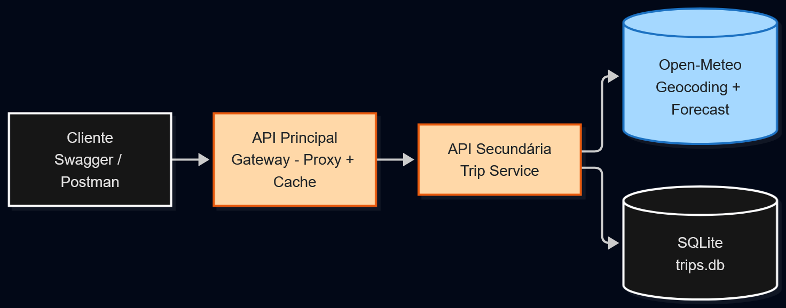

# TravelPlan - Gateway (API Principal)

## Descrição

O TravelPlan ajuda a escolher o melhor dia para viajar dentro de um período,
com base na previsão do tempo. Este repositório contém a API Principal,
que funciona como um proxy para a API Secundária (trip-service): repassa
todas as requisições e mantém um cache em memória das consultas de leitura
(GET), evitando bater na API secundária (e, por consequência, na API
externa) toda vez que a mesma viagem é consultada de novo.

## Arquitetura



Laranja = módulos desenvolvidos neste trabalho. 

Azul = serviço externo consumido.

Fluxo: Cliente -> Gateway (proxy + cache) -> Trip Service (regra de negócio) -> Open-Meteo,
com o Trip Service persistindo os planos de viagem em SQLite.

## Rotas

| Método | Rota | Descrição | Usa cache? |
|---|---|---|---|
| POST | /trips | Cria uma viagem (repassa para o trip-service) | Não |
| GET | /trips | Lista as viagens | Sim |
| GET | /trips/{id} | Detalha uma viagem | Sim |
| PUT | /trips/{id} | Atualiza uma viagem (invalida o cache dela) | Não |
| DELETE | /trips/{id} | Remove uma viagem (invalida o cache dela) | Não |

Documentação interativa (Swagger) disponível em /docs após subir a aplicação.

Demonstração do cache: chame GET /trips/{id} duas vezes seguidas — a segunda
resposta aparece nos logs (docker logs gateway) como [CACHE HIT], sem
repassar a chamada para o trip-service.

## API externa consumida (via trip-service)

- Open-Meteo — https://open-meteo.com
- Gratuita, sem necessidade de cadastro ou chave de API.
- Endpoints usados:
  - Geocoding: GET https://geocoding-api.open-meteo.com/v1/search
  - Previsão: GET https://api.open-meteo.com/v1/forecast
- Licença: CC BY 4.0 — https://open-meteo.com/en/license

## Execução via Docker

Este componente depende da API Secundária (trip-service) para funcionar de
verdade. Para reproduzir a arquitetura completa:

Passo 1: Clone também o repositório do trip-service, numa pasta ao lado desta:

```
git clone https://github.com/matheus-rmds/trip-service.git ../trip-service
```

Passo 2: Crie a rede compartilhada (só precisa fazer isso uma vez):

```
docker network create travelplan-net
```

Passo 3: Construa e rode o trip-service:

```
cd ../trip-service
docker build -t trip-service .
docker run -d --network travelplan-net --name trip-service trip-service
cd ../gateway
```

Passo 4: Construa e rode o gateway:

```
docker build -t gateway .
docker run -d --network travelplan-net -p 8000:8000 -e TRIP_SERVICE_URL=http://trip-service:8001 --name gateway gateway
```

Passo 5: Acesse http://localhost:8000/docs

## Instalação e execução local (sem Docker)

Passo 1: Crie e ative um ambiente virtual:

```
python -m venv .venv
.venv\Scripts\activate
```

Passo 2: Instale as dependências:

```
pip install -r requirements.txt
```

Passo 3: Suba a aplicação (com o trip-service já rodando em outro terminal na porta 8001):

```
uvicorn app.main:app --reload --port 8000
```

Passo 4: Acesse a documentação em http://localhost:8000/docs
